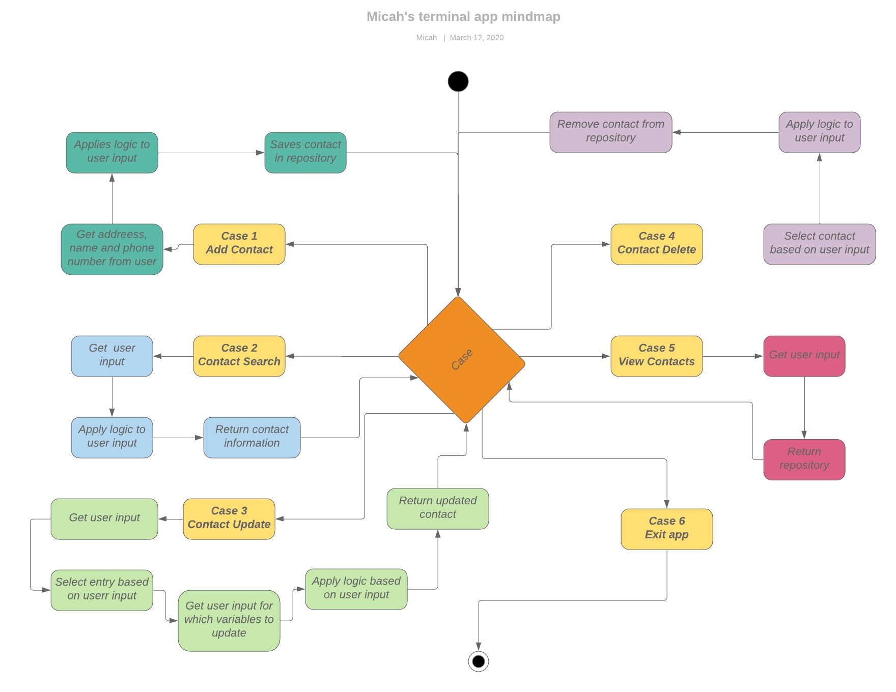

# Micah Rus's terminal app

## Requirements

* Ruby installed
* Access to terminal

## Gems

* I will be using robucop through this assessment

## Testing

### I created a table to show the testing that I did.

| Feature        | Test case summary                                                     | Test Data | Expected result                                                                                                             | Actual result | Status | Comments |
|----------------|-----------------------------------------------------------------------|-----------|-----------------------------------------------------------------------------------------------------------------------------|---------------|--------|----------|
| Add contact    | Will attempt to use this feature, and  all of its options             |           | Selecting this option Should take the user to a menu where they can input the desired information                           | As expected   | Pass   | N/A      |
| Contact Search | Will attempt to use this feature to  locate information               |           | Selecting this option should Prompt the user for input Which once entered will return results with any matching information | As expected   | Pass   | N/A      |
| Delete contact | Will attempt to use feature to remove a contact from the address book |           | Will remove a contact from the address Book                                                                                 | As expected   | Pass   | N/A      |

## Version control

For version control I was using github for this particular project. I initially had it in the suppository below and was committing there, but then moved the files and decided to change repository's to the second one.

The first link is <https://github.com/Hexicans96/terminal_app>

The second(current) link is <https://github.com/Hexicans96/T1A2---Terminal-Application>

## Link to trello

<https://trello.com/b/2amoHbBa/terminal-app>

## Lucidchart

 <https://www.lucidchart.com/documents/edit/283b40f0-11cc-495a-af6c-51b957780e27/0_0?shared=true>

## List of features

* Add a contact.

This is one of the more simple features of my application, once selected it will prompt the user to input the information of the person they want to save in the address book. Such as, name, phone number, and addresses. It will also assign an ID number to each new entry created, this will make it easier to track entries, and allow us to search for and edit them even if they share the same information.

* Search for a contact.

This is a feature that can be used to search for a particular name in the address book, it will take user input then apply logic to it to return the contact based off the user input.

* Update contact.

This was potentially the hardest method to code, simply put when used it will prompt the user for input(ID number), based on that input it will select the hash from the address book array, it will then prompt the user for any changes they would like to make to the name, phone number or address. If they chose to not make a change it will keep the original value.

* Delete a contact.

I went with a different approach other instead of completely deleting the object, I wanted to ID numbers to reference to the point of the array that they were located in. I instead used a replace method to change the values of the hash to 0, in this sense it won't mess up my ID numbers. When searching for a contact these "deleted" hashes will be ignored.

If a false ID is given it will print out an error message and loop you back to the initial menu.

* View address book

This will print the entire address book to terminal, the changes I make will also be reflected once it is printed. For example, it will not print "deleted" objects, and will print all added and updated hashes.

## Statement of purpose and scope

* I have designed this app for the purpose of having an easy to read, easy to use app with the convenience of keeping all my data in one place as well as using minimal computing power.

* This application will store information in multiple ways, the first way is saved to the terminal while the application is running. The secondary way that information is stored will be via a CSV filed that is directly tied to the information stored in the terminal app. This means that every time the application is loaded. As long as the CSV file is installed locally, or accessible online the user data will be accessible.

* The purpose of this application is to have an ease of access when attempting to keep contact information stored. It will do this by storing the appropriate information locally and inside a csv file and allowing the user to access it via the terminal application.

* My application will solve the problem of users having an ability to store all their contact information in an easy to read easy to use application. It will also work to keep the data safe by writing the information to a CSV file.

* The target audience if this application is anybody and everybody even anybody without any technical experience. This application can be used without any initiate knowledge of ruby or how to use a terminal app. Through the implementation of the features and the accessibility of the application, this could easily be a household app.

* The way to use this app will be primarily through user input via the use of the terminal. It will prompt users for input many times throughout the program and these inputs will allow the user to create new information, change existing information, delete information and view all current information. 

* When the application first loads it will load and print the entry point to the screen, which in this case is a menu with branches to all the features of my app. It will then prompt the user for inputs, and based off this input will allow the user to create, read, update or destroy information. After the user has completed their action they will be transported back to the initial menu. The exit point is also located in this initial menu. 

## 	User interaction and experience

* The user will interact with the application simply by inputting text into the command prompt.The user will be prompted on which information is required to have the desired affect. It is a very simple app to use, and I have addded information in the execution of the app that should increase its accessibility.

* The user will interact / use each feature by inputting the information required when prompted to do so.

* Errors will be displayed in a box, telling them what went wrong, it will then direct them back to the entry point.
